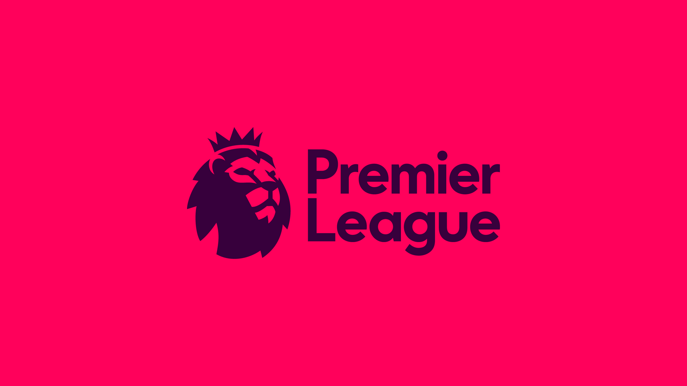

The Premier League is the most watched football league in the world, so it's only natural that their logo plays a big part in the advertising and promotion of the league worldwide. The old logos of this colossal sports league seemed to follow a very similar colour theme, going with base colours of white, blue and red.

The 4 logos displayed shows a gradual development of a very similar logo, so for comparison we will shift the focus to the most recently used logo, that was introduced in 2007 and replaced in 2016. Compared to all the pre-2007 logos, this one uses a bolder logo of a lion, with a more confident stance standing over a football. The typeface used is a type of sans serif with small serifs flaring out at the tips of each letter. 

## Here is a an image

The new logo features a lion's head followed by the Premier League lettering, this time the font being used is a bolder Radikal. It gives the typography a more modern feel, getting rid of the flared serifs, instead adopting letters with sharper finishes