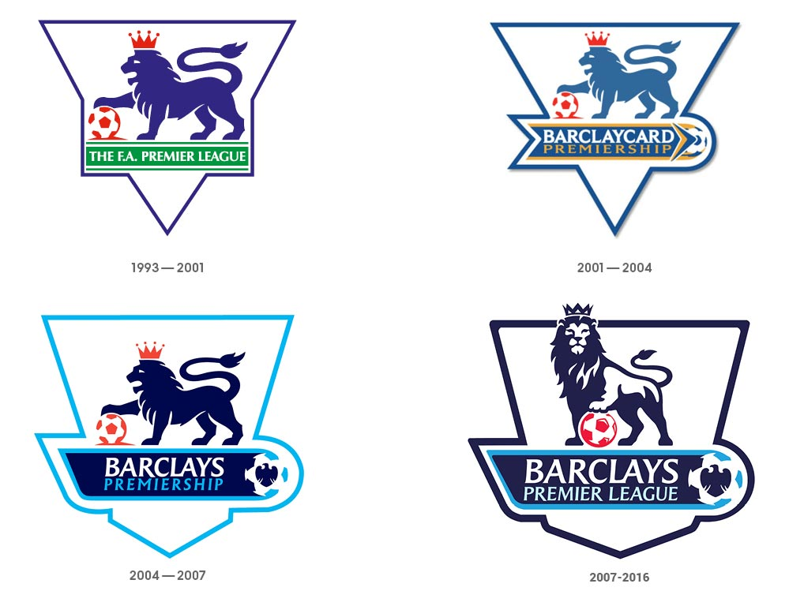

The Premier League is the most watched football league in the world, so it's only natural that their logo plays a big part in the advertising and promotion of the league worldwide. The old logos of this colossal sports league seemed to follow a very similar colour theme, going with base colours of white, blue and red. They all feature a crowned Lion standing on a football, symbolising a sense of pride in being the best and biggest football league in the world. The text used, particularly in the first 2 logos, are fairly simple. They follow a bold typeface and are relatively subtle in comparison to the logo. The size of the font seems to progress as th league took on Barclaycard/Barclays as a sponsor, at which point the sponsor's name is highlighted and is made to stand out in comparison to the rest of the text. 

The 4 logos displayed shows a gradual development of a very similar logo, so for comparison we will shift the focus to the most recently used logo, that was introduced in 2007 and replaced in 2016. Compared to all the pre-2007 logos, this one uses a bolder logo of a lion, with a more confident stance standing over a football. The typeface used is a type of sans serif with small serifs flaring out at the tips of each letter. This logo seems to emphasise the use of the lion as well as the word Barclays. The flared serifs are more prominent in this more than any other of the previous logos, showing development and more care for the use of typography in order to make the logo more noticeable and eye-catching.

The new logo features a lion's head followed by the Premier League lettering, this time the font being used is a bolder Radikal. It gives the typography a more modern feel, getting rid of the flared serifs, instead adopting letters with sharper finishes against a lighter background which so far has been the best use of colour in typography og the logo, as the previous logo only used a white background. The use of purple contrasting with pink in the background highlights the words 'Premier League'