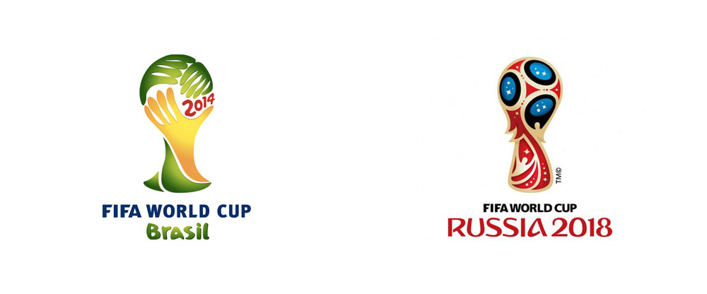

The Russia 2018 World Cup was arguably the greatest World Cup tournament of all time, capped off with a final that finished 4-2 to the eventual winners France against Croatia, with the game having the most goals in a World Cup final in 50 years. However, it is worth noting that the logo that was released almost 4 years before the tounament seemed to receive a strongly positive reaction from the public, taking major steps up from the logo used for the 2014 competition in Brazil. 

As seen above, the 2014 logo is much less complex and got more of a negative