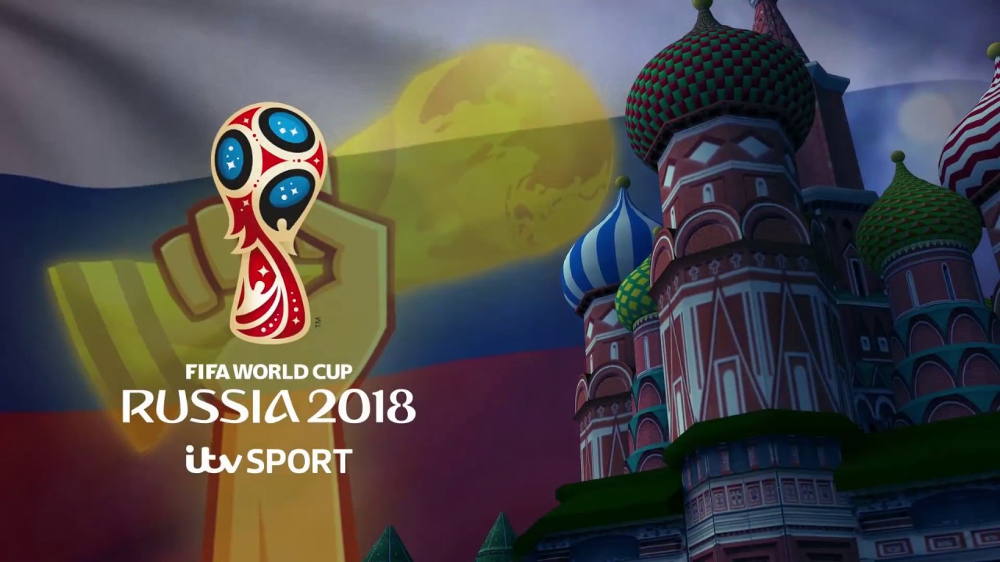

The Russia 2018 World Cup was arguably the greatest World Cup tournament of all time, capped off with a final that finished 4-2 to the eventual winners France against Croatia, with the game having the most goals in a World Cup final in 50 years. However, it is worth noting that the logo that was released almost 4 years before the tounament seemed to receive a strongly positive reaction from the public, taking major steps up from the logo used for the 2014 competition in Brazil. 

As seen above, the 2014 logo is much less complex and got more of a negative reception when it was released. It used a font that is less emphatic than the 2018 logo and had a slightly childish feel about it with the 3D, balloon looking typeface used to spell out 'Brasil'. The logo felt like it was designed for a video game instead of for the world's most watched football tournament. 

The 2018 logo has taken a significantly different route, using the newly developed 'Rusha' as its corporate typeface. It did receive some backlash and even had to handle disputes about its' similarity to the 2014 logo, but I think that there is a huge, noticeable difference between the two. The font 'Rusha', meaning soul in Russian, was created specifically for the logo and was inspired by the shapes of the Russian language. The bolder 2D style also makes more of a professional statement compared to the Brazil World Cup logo's typography and is more definitive, making more of a statement, particularly in advertising during the build up to the tournament itself.

The colours used in this logo, like previous World Cup logos, incoropates the host country's flag colours, which in this scenario is white, blue and red. They are all used in the design of the World Cup trophy, joined with gold, the colour of the actual trophy itself. The mix of these colours bring a bold and vibrant sense to the design, with the logo standing out against any coloured background, as shown in the image above, where it is laid out over a faded Russian flag. The sharp Rusha text also stands out, highlighting the country and tournament the logo is associated with. 

Altogether, this logo is, in my opinion, the best World Cup logo FIFA have used in years, as the colour scheme of the letters and logo as well as the typeface used for the words compliment each other and create a dashing and spirited design, which did perfectly put the tournament promoters in good stead ahead of the world's biggest football event.