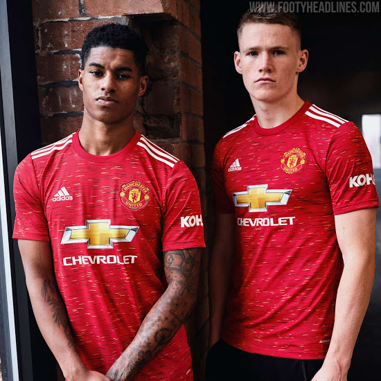

Manchester United is the most supported football club in the world. It boasts the highest shirt sales of any club with their millions of fans all over the world. Hand in hand with this is its very noticeable and iconic club logo, which features the club's signature red devil as well as a ship to pay homage to the roots of the city as a shipping port. 

The logo can be seen in multiple advertisements in different regions of the world such as Melitta coffee or Mlily mattresses and pillows, with companies often flaunting their sponsorship with the club by displaying the badge in photo and video adverts. But what makes it stand out so much? We could possibly attribute that to the colour scheme of a brighter shade of red and a slightly darker yellow, combining to make the prestigious club badge.

The font used on the badge itself is ITC Stone Sans II. It is a sans-serif font and the fact that is part of the stone family of the ITC font makes it look more modern and dynamic compared to if it would have serifs or an informal style of the typeface. The choice of this font has been a smart one, as this particular badge was only introduced in 1998, over 20 years ago. It still looks relevant and with the times today despite it being around for that long, emphasising the intelligence with the choice of ITC as a font generally.

It is now a logo that is synonymous with the club and its power in the business world as well as the football world, as is likely the only badge that is remembered by fans in this century despite there being 4/5 other badges that have been used in the history of the club.