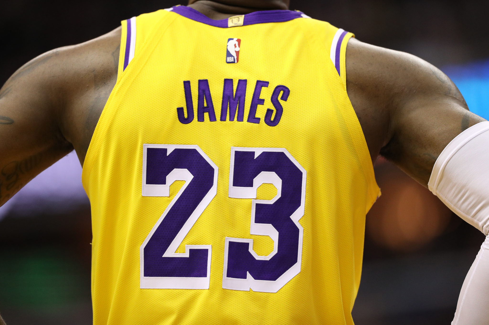

This goes without saying: The NBA is the most popular and the most watched basketball league in the world. 30 teams from all over America battle it out in an 82 game regular season to qualify for the play-offs, for which the finals attracted 7.5m viewers in the USA alone. The logo was designed decades ago, in 1969, with the iconic silhouette being an outline of then NBA player Jerry West of the Los Angeles Lakers.

The logo is on the back of each jersey, albeit a small print at the top. The colours of the logo are inspired by the colours of the flag that represents the country the NBA is in. It is, of course, the United States of America. The simplicity of the logo and the hesitation from the organisation to develop it any further shows how iconic it has become. It goes without saying that the marketability also is an incentive to keep the logo the way it is.

The typeface that is used is also very uncomplicated, adopting the well-known helvetica, one of the most common sans-serif fonts along with Arial, Times New Roman and Verdana among others. These fonts are some of the most popular and used on the internet, with certain typefaces such as Verdana being specifically designed for use on computers. There is an argument as to whether serifs or sans-serifs are easier to reas, with the general conclusion being that serifs are easier to read on print and sans-serifs are better suited to computer screens.

Helvetica is often described as a safe font, with there being nothing particularly striking or outstanding about it, however its boldness and sharpness in the NBA logo, which is equally simple and not overthought in its design makes it a perfect fit, creating this memorable and timeless logo that millions all over the world associate with the elite basketball league.