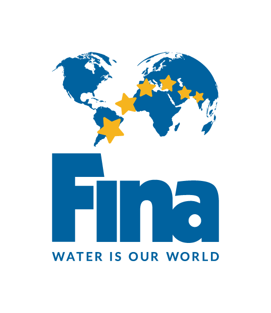
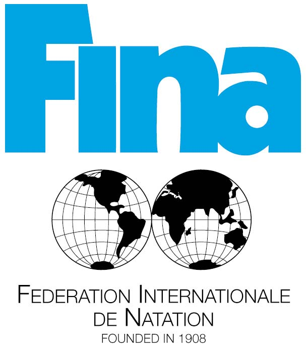

The world of water sports is a very intense and often unforgiving place. Training in these sports, for example swimming, can be some of the most strenuous and tough programs in the entire sports landscape. Fina is the governing body of these water sports and organises official international competition in water sports. The abbreviation Fina stands for “Fédération Internationale de Natation”, translating to International Swimming Federation. 

The logo has 6 stars to represent the 6 main water sports that Fina represents, and they are spread out across a slightly spherical map of the world, to show that they are international and inclusive of all countries and nationalities of athletes around the world, a point they try to make very clear with their public image. 

The font of the word 'Fina' is very similar to Sarun Pro Narrow Ultra, a sans-serif font that is reliant on its boldness and thickness of each letter to jump out from the page/screen it is on to viewers. This, coupled with the obvious choice of a blue colour, gives the Fina typeface its own unique style and look on which it is noticeable and iconic in the sports world, whether it be in the corner of promotional posters for competitions or in advertisements for certain products.

The text below the Fina word, 'Water is our world' is in the URW Grotesk SC Regular type face, another sans-serif font that is striking due to the thin, sharp shapes of the letters that are in bold, as it is in the Fina name, but contrasts in the sense that the slogan is in all capitals despite them being in a smaller size. 

The use of sans-serif fonts in both the name and slogan of the Fina organisation could be due to their efforts to come across as a modern company that has simple goals to help the world of water sports thrive. The logo is more minimalistic and straightforward that the previous logo, which can be seen below, on which there are far too many details for the logo to be as noticeable or clear-cut as it is today. The font choice for the text at the bottom is also far too thin and subtle to catch the eye.

All in all, it's good that Fina decided to change their logo and modernise it for present use.